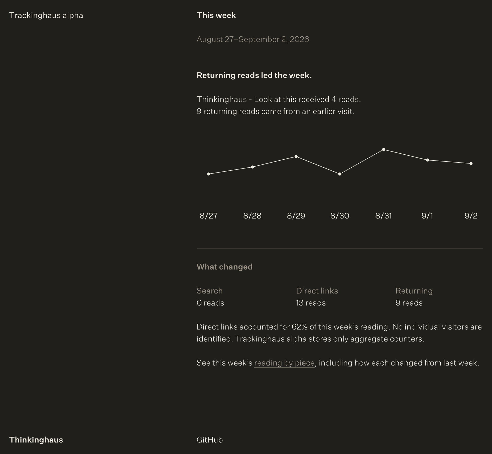

# Trackinghaus alpha

Trackinghaus alpha is a small, self-hosted weekly reading for an independent publication. It counts aggregate reads, finds one useful signal in the week, and leaves the rest alone.

There is no Trackinghaus account, audience profile, dashboard full of activity, or subscription between a writer and their own data. Each deployment belongs to one publication. The code is shared; the database, domain, email, and reading stay with the person who runs it.

[Thinkinghaus](https://thinking.haus) is the reference installation. Its public weekly reading is at [trackinghaus-alpha.vercel.app](https://trackinghaus-alpha.vercel.app).

[Deploy with Vercel](https://vercel.com/new/clone?repository-url=https%3A%2F%2Fgithub.com%2Fmxpf%2Ftrackinghaus&env=TRACKINGHAUS_SITE_KEY%2CTRACKINGHAUS_SITE_NAME%2CTRACKINGHAUS_ALLOWED_ORIGINS%2CTRACKINGHAUS_TIME_ZONE&envDescription=Tell%20Trackinghaus%20which%20blog%20it%20should%20count.&envLink=https%3A%2F%2Fgithub.com%2Fmxpf%2Ftrackinghaus%23configuration&project-name=trackinghaus&repository-name=trackinghaus)



## What lives here

```text
src/       the public weekly reading
api/       collection, weekly data, health, and the optional email job
lib/       aggregate summaries, configuration, storage, and mail helpers
db/        the small Postgres schema
public/    the tracker loaded by the host publication
worker/    the static-hosting handoff
tests/     privacy, API, summary, and hosting checks
```

The public dashboard is only a view of aggregate counters. The tracker sends no IP address, user agent, cookie, visitor ID, raw referrer, query string, or URL fragment. It respects Global Privacy Control and Do Not Track.

## Make it yours

Create one Vercel project for one publication. Set this repository as the source, connect Neon Postgres, and add the publication’s own environment values. No separate codebase is needed.

```text
TRACKINGHAUS_SITE_KEY=small-internet
TRACKINGHAUS_SITE_NAME=A Small Internet
TRACKINGHAUS_ALLOWED_ORIGINS=https://example.com,https://www.example.com
TRACKINGHAUS_TIME_ZONE=America/New_York
```

The first allowed origin becomes the link in the dashboard footer. Additional comma-separated origins can contribute to the same aggregate reading.

### Connect the database

Add a Neon Postgres integration in the Vercel Marketplace. It supplies `DATABASE_URL`. Trackinghaus creates its aggregate table on the first read, so there is no migration command to run.

After adding the environment values, redeploy and visit:

```text
https://YOUR-TRACKINGHAUS-DOMAIN/api/health
```

`database` and `site` should be `true`. `email` can remain `false` when a weekly email is not needed.

### Add the tracker

Add this once in the shared layout of the publication, immediately before `</body>`:

```html
<script
  defer
  src="https://YOUR-TRACKINGHAUS-DOMAIN/tracker.js"
  data-site="small-internet"
></script>
```

`data-site` must match `TRACKINGHAUS_SITE_KEY`. Open a page on the publication, then open the Trackinghaus deployment. The first weekly reading appears as aggregate reads arrive.

### Add a weekly email, if it helps

Resend is optional. Install it through the Vercel Marketplace, verify a sending domain, and add:

```text
TRACKINGHAUS_TO_EMAIL=you@example.com
TRACKINGHAUS_FROM_EMAIL=Trackinghaus alpha <stats@example.com>
CRON_SECRET=a-long-random-value
```

Resend provides `RESEND_API_KEY`. When all four values are present, Vercel Cron sends the previous week’s reading each Monday. Without them, the public dashboard continues quietly.

## Configuration

| Variable | Required | Purpose |
| --- | --- | --- |
| `DATABASE_URL` | Yes | Neon Postgres connection from the integration. |
| `TRACKINGHAUS_SITE_KEY` | Yes | Stable site key, also used by `data-site`. |
| `TRACKINGHAUS_SITE_NAME` | Yes | Publication name shown in the footer. |
| `TRACKINGHAUS_ALLOWED_ORIGINS` | Yes | Comma-separated `https://` origins allowed to send reads. |
| `TRACKINGHAUS_TIME_ZONE` | Yes | IANA timezone used for calendar days; defaults to `UTC`. |
| `TRACKINGHAUS_DASHBOARD_URL` | No | Public dashboard URL; normally inferred by Vercel. |
| `TRACKINGHAUS_REPOSITORY_URL` | No | Source link in the footer; normally inferred from the Vercel Git repository. |
| `RESEND_API_KEY` | For email | Resend credential. |
| `TRACKINGHAUS_TO_EMAIL` | For email | Monday-reading recipient. |
| `TRACKINGHAUS_FROM_EMAIL` | For email | Verified sender name and address. |
| `CRON_SECRET` | For email | Secret Vercel uses to authenticate the scheduled request. |

`TRACKINGHAUS_ALLOWED_ORIGIN` remains available for an existing single-origin deployment.

## The privacy boundary

The browser keeps one local yes/no flag for returning reads. Session storage prevents repeat counts for the same page on the same day. The server receives only the day, page path and title, source category, read count, and returning-read count.

The dashboard is public by design, so it contains aggregate counters only. No individual visitors are identified. Trackinghaus alpha stores only aggregate counters.

## Local checks

```bash
npm install
npm run dev
npm test
```

The test command builds both deployment targets and runs the privacy, API, summary, and hosting checks. The local view uses representative demo data. Copy `.env.example` to `.env.local` only when testing the live functions with a Vercel-linked environment; never commit a populated environment file.

## The useful constraint

Trackinghaus supports one publication per deployment. It does not include accounts, billing, visitor profiles, real-time activity, or a multi-site control panel. A separate deployment keeps each writer’s data and service accounts in their own hands.

## License

Trackinghaus is available under the [MIT License](./LICENSE).
